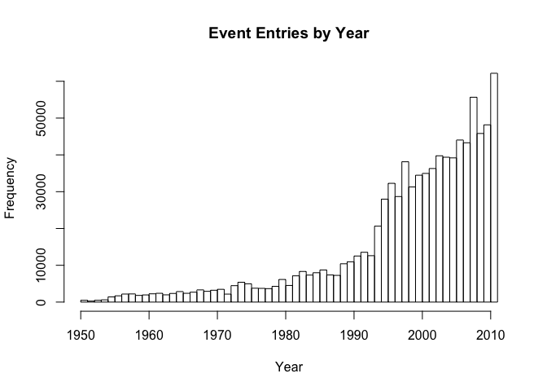
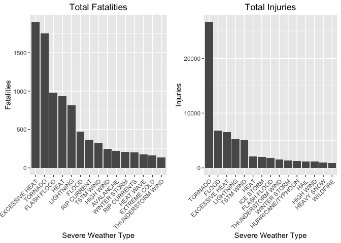

# Reproducible Research: Peer Assessment 2
by: Juan Agustin Melendez  
July 24, 2015  

## Exploring Health and Economic Impact of Severe Weather Events in the US

### Synopsis
This report investigates which severe weather events are the most harmful in terms of public health, analysing the fatalities and injuries cause by these events. The economic impact of these events was investigated by analysing the damage caused to property and crop (in terms of US Dollars). The data was provided by the National Oceanic and Atmospheric Administration (NOAA). A preliminary analysis of the data demonstrates that excessive heat and tornadoes have the highest number of fatalities. Tornadoes have the highest number of injuries followed by floods and excessive heat. Regarding economic impact of severe weather in the US, floods causes the most damage to property while drought causes the most damage to crops. The economic impact due to injuries and fatalities were not taken into consideration in this report.  

### Loading and Processing Data

```r
library(ggplot2)
library(gridExtra)
file <- "repdata-data-StormData.csv.bz2"
storm.data <- read.csv(bzfile(file), header = TRUE, stringsAsFactors = FALSE)
dim(storm.data)
```

```
## [1] 902297     37
```

```r
names(storm.data)
```

```
##  [1] "STATE__"    "BGN_DATE"   "BGN_TIME"   "TIME_ZONE"  "COUNTY"    
##  [6] "COUNTYNAME" "STATE"      "EVTYPE"     "BGN_RANGE"  "BGN_AZI"   
## [11] "BGN_LOCATI" "END_DATE"   "END_TIME"   "COUNTY_END" "COUNTYENDN"
## [16] "END_RANGE"  "END_AZI"    "END_LOCATI" "LENGTH"     "WIDTH"     
## [21] "F"          "MAG"        "FATALITIES" "INJURIES"   "PROPDMG"   
## [26] "PROPDMGEXP" "CROPDMG"    "CROPDMGEXP" "WFO"        "STATEOFFIC"
## [31] "ZONENAMES"  "LATITUDE"   "LONGITUDE"  "LATITUDE_E" "LONGITUDE_"
## [36] "REMARKS"    "REFNUM"
```

```r
# Subsetting the columns of interest
col.index <- which(colnames(storm.data) %in% c("BGN_DATE", "EVTYPE", "INJURIES", "FATALITIES", "PROPDMG","PROPDMGEXP", "CROPDMG", "CROPDMGEXP"))
sd <- storm.data[, col.index]
names(sd)
```

```
## [1] "BGN_DATE"   "EVTYPE"     "FATALITIES" "INJURIES"   "PROPDMG"   
## [6] "PROPDMGEXP" "CROPDMG"    "CROPDMGEXP"
```

```r
# Creating a column for the entry year
sd$YEAR <- as.numeric(format(as.Date(sd$BGN_DATE, format = "%m/%d/%Y %H:%M:%S"), "%Y"))
hist(sd$YEAR, breaks=50, xlab="Year", main="Event Entries by Year")
```

<!-- -->

The graph above shows the total number of cases reported per year. It shows an increase in cases entered over the yaers. In particular, the trend increases significantly from 1990 to 2000. This could be due to emphasis given to acquiring this kind of data and to advances in data acquisition and storing capabilities. Data from 1990-2011 was considered for purposes of this analysis.  


```r
# Subsetting data from 1990-2011 
sd <- sd[sd$YEAR >= 1990, ]
dim(sd)
```

```
## [1] 751740      9
```

```r
# Evaluating PROPDMGEXP and CROPDMGEXP columns
sd$PROPDMGEXP <- toupper(sd$PROPDMGEXP)
unique(sd$PROPDMGEXP)
```

```
##  [1] ""  "M" "K" "B" "+" "0" "5" "6" "?" "4" "2" "3" "H" "7" "-" "1" "8"
```

```r
sd$CROPDMGEXP <- toupper(sd$CROPDMGEXP)
unique(sd$CROPDMGEXP)
```

```
## [1] ""  "M" "K" "B" "?" "0" "2"
```

```r
sd$EVTYPE <- toupper(sd$EVTYPE)
length(unique(sd$EVTYPE))
```

```
## [1] 898
```

```r
str(sd)
```

```
## 'data.frame':	751740 obs. of  9 variables:
##  $ BGN_DATE  : chr  "1/5/1990 0:00:00" "1/20/1990 0:00:00" "1/20/1990 0:00:00" "1/25/1990 0:00:00" ...
##  $ EVTYPE    : chr  "HAIL" "TSTM WIND" "TSTM WIND" "TSTM WIND" ...
##  $ FATALITIES: num  0 0 0 0 0 0 0 0 0 0 ...
##  $ INJURIES  : num  0 0 0 0 28 0 0 0 0 0 ...
##  $ PROPDMG   : num  0 0 0 0 2.5 0 0 0 25 25 ...
##  $ PROPDMGEXP: chr  "" "" "" "" ...
##  $ CROPDMG   : num  0 0 0 0 0 0 0 0 0 0 ...
##  $ CROPDMGEXP: chr  "" "" "" "" ...
##  $ YEAR      : num  1990 1990 1990 1990 1990 1990 1990 1990 1990 1990 ...
```

```r
# Calculating total property damage
sd$PROPDMGEXP[sd$PROPDMGEXP == "?"] <- "0"
sd$PROPDMGEXP[sd$PROPDMGEXP == "+"] <- "0"
sd$PROPDMGEXP[sd$PROPDMGEXP == "-"] <- "0"
sd$PROPDMGEXP[sd$PROPDMGEXP == ""] <- "0"
sd$PROPDMGEXP[sd$PROPDMGEXP == "1"] <- "0"
sd$PROPDMGEXP[sd$PROPDMGEXP == "2"] <- "0"
sd$PROPDMGEXP[sd$PROPDMGEXP == "3"] <- "0"
sd$PROPDMGEXP[sd$PROPDMGEXP == "4"] <- "0"
sd$PROPDMGEXP[sd$PROPDMGEXP == "5"] <- "0"
sd$PROPDMGEXP[sd$PROPDMGEXP == "6"] <- "0"
sd$PROPDMGEXP[sd$PROPDMGEXP == "7"] <- "0"
sd$PROPDMGEXP[sd$PROPDMGEXP == "8"] <- "0"
sd$PROPDMGEXP[sd$PROPDMGEXP == "H"] <- "2"
sd$PROPDMGEXP[sd$PROPDMGEXP == "K"] <- "3"
sd$PROPDMGEXP[sd$PROPDMGEXP == "M"] <- "6"
sd$PROPDMGEXP[sd$PROPDMGEXP == "B"] <- "9"
sd$PROPDMGEXP <- as.numeric(sd$PROPDMGEXP)
# Creating new column for total property damage
sd$PROPDMGTOT <- sd$PROPDMG*10^sd$PROPDMGEXP

#Calculating total crop damage
sd$CROPDMGEXP[sd$CROPDMGEXP == ""] <- "0"
sd$CROPDMGEXP[sd$CROPDMGEXP == "?"] <- "0"
sd$CROPDMGEXP[sd$CROPDMGEXP == "2"] <- "0"
sd$CROPDMGEXP[sd$CROPDMGEXP == "B"] <- "9"
sd$CROPDMGEXP[sd$CROPDMGEXP == "M"] <- "6"
sd$CROPDMGEXP[sd$CROPDMGEXP == "K"] <- "3"
sd$CROPDMGEXP <- as.numeric(sd$CROPDMGEXP)
#Creating new column for total crop damage
sd$CROPDMGTOT <- sd$CROPDMG*10^sd$CROPDMGEXP
```

### Handling CROPDMGEXP, PROPDMGEXP, and EVTYPE Columns
Based on the code book provided for the data, CROPDMGEXP and PROPDMGEXP columns are supposed to contain only the letters "K", "M", and "B" (for thousands, millions, and billions respectively). When examining these columns, other characters were found including numbers and punctuation marks. When calculating the total damage to property and crop, only entries that were correctly provided in these columns were considered to be of the value provided. The only exception that was considered was the letter "H" (appearing only on the PROPDMGEXP column) which could be assumed to be hundreads. All the other characters where not multiplied by any factor when calculatiing totals to avoid incorrectly guessing values.  

It is worth noting that only 48 EVTYPE were described on the code book but the EVTYPE column had a total of 898 unique entries (after subsetting the data by the years 1990-2011), many of which were not explicitly listed as events on the code book. For purposes of this analysis, the EVTYPE column was not manipulated to avoid making any incorrect assumptions. Nonetheless, an analysis is performed below to determine if inconsistencies in data entry produced major variabilty in the results.  


```r
#Health impact by fatalities
fatality <- aggregate(FATALITIES~EVTYPE, data=sd, FUN=sum) 
fat.top15 <- fatality[order(fatality$FATALITIES, decreasing=TRUE),][1:15,]
rownames(fat.top15) <- 1:15
fat.top15$EVTYPE <- factor(fat.top15$EVTYPE, levels=fat.top15$EVTYPE, ordered = TRUE)
fat.top15
```

```
##               EVTYPE FATALITIES
## 1     EXCESSIVE HEAT       1903
## 2            TORNADO       1752
## 3        FLASH FLOOD        978
## 4               HEAT        937
## 5          LIGHTNING        816
## 6              FLOOD        470
## 7        RIP CURRENT        368
## 8          TSTM WIND        327
## 9          HIGH WIND        248
## 10         AVALANCHE        224
## 11      WINTER STORM        206
## 12      RIP CURRENTS        204
## 13         HEAT WAVE        172
## 14      EXTREME COLD        162
## 15 THUNDERSTORM WIND        133
```

```r
# Fatalities by excessive/extreme/high heat related events 
fat.heat <- fatality[grep("HEAT", fatality$EVTYPE),]
fat.heat.tot <- sum(fat.heat$FATALITIES)
fat.heat.avg <- round((fat.heat.tot/sum(fatality$FATALITIES))*100,0)

# Fatalities by flooding related
fat.flood <- fatality[grep("FLOOD", fatality$EVTYPE), ]
fat.flood.tot <- sum(fat.flood$FATALITIES)

# Fatalities by tornado related
fat.tornado <- fatality[grep("TORNADO", fatality$EVTYPE),]
fat.tornado.tot <- sum(fat.tornado$FATALITIES)

# Average of top 3 fatality causes  
fat.top3.avg <- round(((fat.heat.tot + fat.flood.tot + fat.tornado.tot)/sum(fatality$FATALITIES))*100, 0)

# Creating data frame with top 3 fatality causes and combined average
fat.top3.df <- data.frame(fat.heat.tot, fat.tornado.tot, fat.flood.tot, fat.top3.avg)
names(fat.top3.df) <- c("HEAT", "TORNADO", "FLOOD", "COMB.AVG")
rownames(fat.top3.df) <- c("FATALITIES")

#Health impact by injuries
injured <- aggregate(INJURIES~EVTYPE, data=sd, FUN=sum)
inj.top15 <- injured[order(injured$INJURIES, decreasing=TRUE),][1:15,]
rownames(inj.top15) <- 1:15
inj.top15$EVTYPE <- factor(inj.top15$EVTYPE, levels=inj.top15$EVTYPE, ordered=TRUE)
inj.top15
```

```
##               EVTYPE INJURIES
## 1            TORNADO    26674
## 2              FLOOD     6789
## 3     EXCESSIVE HEAT     6525
## 4          LIGHTNING     5230
## 5          TSTM WIND     5022
## 6               HEAT     2100
## 7          ICE STORM     1975
## 8        FLASH FLOOD     1777
## 9  THUNDERSTORM WIND     1488
## 10      WINTER STORM     1321
## 11 HURRICANE/TYPHOON     1275
## 12              HAIL     1139
## 13         HIGH WIND     1137
## 14        HEAVY SNOW     1021
## 15          WILDFIRE      911
```

```r
# Injuries by tornado related 
inj.tornado <- injured[grep("TORNADO", injured$EVTYPE), ]
inj.tornado.tot <- sum(inj.tornado$INJURIES)
inj.tornado.avg <- round((inj.tornado.tot/sum(injured$INJURIES))*100,0)

# Injuries by flood related
inj.flood <- injured[grep("FLOOD", injured$EVTYPE), ]
inj.flood.tot <- sum(inj.flood$INJURIES)

# Injuries by heat related
inj.heat <- injured[grep("HEAT", injured$EVTYPE),]
inj.heat.tot <- sum(inj.heat$INJURIES)

# Average of top 3 injury causing events
inj.top3.avg <- round((sum(inj.tornado.tot + inj.flood.tot + inj.heat.tot)/sum(injured$INJURIES))*100, 0)

# Creating data frame with top 3 injury causes and combined average
inj.top3.df <- data.frame(inj.tornado.tot, inj.heat.tot, inj.flood.tot, inj.top3.avg)
names(inj.top3.df) <- c("TORNADO", "HEAT", "FLOOD", "COMB.AVG")
rownames(inj.top3.df) <- c("INJURIES")

#Health impact plot
fat.plot <- qplot(EVTYPE, data=fat.top15, weight = FATALITIES) + geom_bar() + theme(axis.text.x = element_text(angle = 45, hjust = 1)) + xlab("Severe Weather Type") + ylab("Fatalities") + ggtitle("Total Fatalities")


inj.plot <- qplot(EVTYPE, data=inj.top15, weight = INJURIES) + geom_bar() + theme(axis.text.x = element_text(angle = 45, hjust = 1)) + xlab("Severe Weather Type") + ylab("Injuries") + ggtitle("Total Injuries")

# Economic impact by property damage 
property <- aggregate(PROPDMGTOT~EVTYPE, data=sd, FUN=sum)
prop.top15 <- property[order(property$PROPDMGTOT, decreasing=TRUE),][1:15,]
rownames(prop.top15) <- 1:15
prop.top15$EVTYPE <- factor(prop.top15$EVTYPE, levels=prop.top15$EVTYPE, ordered=TRUE)
prop.top15
```

```
##               EVTYPE   PROPDMGTOT
## 1              FLOOD 144657709807
## 2  HURRICANE/TYPHOON  69305840000
## 3        STORM SURGE  43323536000
## 4            TORNADO  30458515609
## 5        FLASH FLOOD  16140812067
## 6               HAIL  15732267543
## 7          HURRICANE  11868319010
## 8     TROPICAL STORM   7703890550
## 9       WINTER STORM   6688497251
## 10         HIGH WIND   5270046295
## 11       RIVER FLOOD   5118945500
## 12          WILDFIRE   4765114000
## 13  STORM SURGE/TIDE   4641188000
## 14         TSTM WIND   4484958495
## 15         ICE STORM   3944927860
```

```r
# Average of top 5 property damage
prop.top5.avg <- round((sum(prop.top15[,2][1:5])/sum(property[,2]))*100,0)

# Economic impact by crop damage 
crop <- aggregate(CROPDMGTOT~EVTYPE, data=sd, FUN=sum)
crop.top15 <- crop[order(crop$CROPDMGTOT, decreasing=TRUE),][1:15,]
rownames(crop.top15) <- 1:15
crop.top15$EVTYPE <- factor(crop.top15$EVTYPE, levels=crop.top15$EVTYPE, ordered=TRUE)
crop.top15
```

```
##               EVTYPE  CROPDMGTOT
## 1            DROUGHT 13972566000
## 2              FLOOD  5661968450
## 3        RIVER FLOOD  5029459000
## 4          ICE STORM  5022113500
## 5               HAIL  3025954473
## 6          HURRICANE  2741910000
## 7  HURRICANE/TYPHOON  2607872800
## 8        FLASH FLOOD  1421317100
## 9       EXTREME COLD  1312973000
## 10      FROST/FREEZE  1094186000
## 11        HEAVY RAIN   733399800
## 12    TROPICAL STORM   678346000
## 13         HIGH WIND   638571300
## 14         TSTM WIND   554007350
## 15    EXCESSIVE HEAT   492402000
```

```r
#Average of top 5 crop damage
crop.top5.avg <- round((sum(crop.top15[,2][1:5])/sum(crop[,2]))*100,0)

#Economix impact plots
prop.plot <- qplot(EVTYPE, data=prop.top15, weight = PROPDMGTOT) + geom_bar() + theme(axis.text.x = element_text(angle = 45, hjust = 1)) + xlab("Severe Weather Type") + ylab("Property Damage in US Dollars") + ggtitle("Total Property Damage")

crop.plot <- qplot(EVTYPE, data=crop.top15, weight = CROPDMGTOT) + geom_bar() + theme(axis.text.x = element_text(angle = 45, hjust = 1)) + xlab("Severe Weather Type") + ylab("Crop Damage in US Dollars") + ggtitle("Total Crop Damage")
```

### Results

### 1. Impact on Health 


```r
grid.arrange(fat.plot, inj.plot, ncol=2)
```

<!-- -->

The graph above shows the number of fatalities and injuries from 1990 until 2011. Excessive heat and tornadoes have the highest number of fatalities while tornadoes have the highest number of injuries.

The data was also evaluated to consider inconsistencies in data entry. The table below shows the top three events causing the most fatalities. All the entries that included the word "TORNADO", "HEAT", "FLOOD" where evaluated to determine what fraction of the total fatalities those events are responsible for. 


```r
fat.top3.df
```

```
##            HEAT TORNADO FLOOD COMB.AVG
## FATALITIES 3138    1780  1525       58
```

Fatalities related to heat events are responsible for **28**% of the total fatalities caused by severe weather. The combined average of fatalities related to heat, tornadoes, and floods is **58**%. This means that these three type of events (when considering inconsistencies in data entry) are responsible for over half the total fatalities reported. 

The same evaluation was performed for the total injuries caused by severe weather.


```r
inj.top3.df
```

```
##          TORNADO HEAT FLOOD COMB.AVG
## INJURIES   26735 9224  8604       60
```

When examing injuries related to severe weather, tornados are responsible for **36**% of the total injuries reported. Heat related events came in second this time as supposed to flood related (as suggested in the previous bar graph). Again, these three types of event are responsible for **60**% of the total reported injuries when considering inconsistencies in data entry. 

### 2. Economic Impact on Property and Crop


```r
grid.arrange(prop.plot, crop.plot, ncol=2)
```

<!-- -->

The graph above shows the damage caused in US Dollars by severe weather events from 1990 until 2011. As can be seen, floods causes the greatest economic damage to property while drought causes the most damage to crops.   

Inconsistencies in data entry were not considered when analysing the economic impact of severe weather because the differences between the first and second events causing the most damage in both property and crop are quite significant. Furthermore, the top five events that caused the most damage to property and crop correspond to **76**% and **67**%  of the total reported loss respectively. Based on this analysis, it is fair to assume that any further analysis performed to consider inconsistencies in data entry will not yield much different results. 


