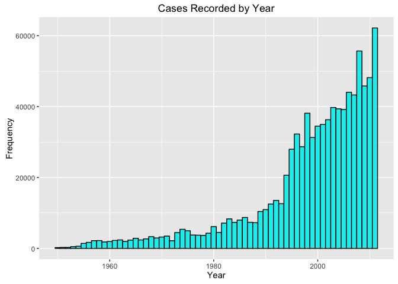

# Exploring Health and Economic Impact of Severe Weather Events in the US
Juan Agustin Melendez  
July 24, 2015  

## Introduction
This report explores the StormData dataset as part of the Reproducible Research course of the Data Science Specialization provided by Coursera and Johns Hopkins University. The report attempt to identify which severe weather events has the highest impact in public health by analysing the rate at which these types of events causes injuries and fatalities. The economic impact of these events is also explored by analysing the damage caused to property and crop in terms of US dollars. The data was provided by the National Oceanic and Atmospheric Administration (NOAA) and contains data for severe weather events in the US from 1950-2011. 

A preliminary analysis of the data demonstrates that excessive heat and tornadoes have the highest anual rate of fatalities. Tornadoes have the highest rate of injuries followed by excessive heat and floods. Historically floods and droughts has caused the most damage to property and crop respectively. Nonetheless, hurricanes/typhoons have the highest rate of property damage and river floods have the highest rate of crop damage in the US. 

### Initial Exploration of Data

From a histogram of the frequency of cases recorded per year, it can be seen that in the mid 1990s there is a significant increase in cases recorded. The number of cases approximately doubled in 1995 compared to 1990. Prior to 1993, the only weather event types recorded in the data were tornadoes, thunderstorm winds, and hail. In 1993 the number of unique weather event recorded increased to 40 from only 3 in the previous 10 years. Tornadoes were the only weather event recorded from 1950 to 1983. Below is a plot of cases recorded per year for the entire dataset. 

<!-- -->


If the entire dataset was to be considered, tornadoes would have the highest number of fatalities and injuries recorded having approximately 5600 fatalities and over 90K injuries from 1950-2011. These totals correspond to a rate of 91 fatalities and 1473 injuries per year. These totals are for event type recorded as "tornado" or "tornadoes" solely. How inconsistencies in data entry in the EVTYPE variable are handled is explained in the next section of this analysis. The proportions of fatalities and injuries caused by tornadoes in the years prior to 1993 are summarized below.


```
           Pre-1993 Overall Proportion (%)
fatalities     4012    5633           71.2
injuries      68036   91346           74.5
```

Fatalities and injuries caused by tornadoes  prior to 1993 correspond to 71% and 75% of the total fatalities and injuries caused by tornadoes in the dataset. Due to the lack of prelevance of other severe weather events in the dataset prior to 1993, it is necessary to perform an analysis for the later years when data is available for a wider range of weather event types. The later part of this analysis will focus on a subset of the data for the years 1993-2011. 

### Discrepancies in Data Entry
There are inconsistencies in data entry in several of the variables used in this analysis. Based on the code book provided for the data, CROPDMGEXP and PROPDMGEXP columns are supposed to contain only the letters "K", "M", and "B" (for thousands, millions, and billions respectively). When examining these columns, other characters were found including numbers and punctuation marks. When calculating the total damage to property and crop in US dollars, only cases in which the CROPDMGEXP and PROPDMGEXP variables were correctly entered were exponentiated accordingly to reflect the value provided. All the other cases were not exponentiated by any factor and solely the value provided in the CROPDMG and PROPDMG columns were used. The only exception that was considered is the letter "H" (appearing only on the PROPDMGEXP column) which could be assumed to be hundreads.

It is also worth noting that only 48 EVTYPE were described in the code book but the EVTYPE column has a total of 898 unique entries, many of which were not explicitly listed as weather events in the code book. Some of these are duplicates of the same category entered in different ways or contain multiple categories in a single entry (e.g. "TORNDADO/TSTM"). For purposes of this analysis, the EVTYPE column was not manipulated to avoid making assumption that could potentially introduce more uncertainty into the data. Nonetheless, an analysis is performed below to determine if inconsistencies in data entry produced major variabilty in the results.


### Impact on Health
The charts below show fatality and injury rates for fifteen severe weather events with the highest rates from 1993-2011. In total, excessive heat has caused the most fatalities being responsible for approximately 1900 fatalities at a rate of approximately 100 fatalities per year. Tornadoes have the second highest total fatality count having approximatedly 1600 fatalities and a rate of 85 fatalities per year. Tornadoes has the highest annual injury rate at approximately 1200 injuries per year and is almost four times the rate compared to the event with second most highest annual injury rate.   


<!-- -->

Discrepancies in entries in the EVTYPE column explained in the previous section can be observed in the charts above. As can be seen, there are four different instances of heat related weather events just in the top fifteen fatality rate chart. There are also instances where tornadoes and TSTM appear together as one entry and others where thunderstorm is abbreviated as TSTM. The same is observed throughout the dataset for other categories entered in the EVTYPE column. To evaluate the impact of these discrepancies, four different groups were created (Heat, Tornado/TSTM, Flood, and Other) encompassing four of the categories with the highest rates and one group for all the other categories. These groups were formed depending on wether key words appeared in each particular entry in the EVTYPE column.  Total sums were calculated for each group and new rates were calculated for the categories Heat, Tornado/TSTM, and Flood. These rates were analyzed to determine if different results were obtained by lumping the catefories in EVTYPE columns into groups. The chart below shows the proportion of total fatalities and injuries each group had within the dataset.  

<!-- -->


As can be seen from the chart above, heat, tornadoes/TSTM, and flood related events combined are responsible for 62.4% of the total fatalities and 69% of the total injuries reported. As expected, the rates for each of these categories increased when lumping them into their respective category. Nonetheless the order still follows, heat related events continue to be the most deadly extreme weather event in the US having 165 fatalities/year followed by the Tornado/TSTM category having 111 fatalities/year. Tornadoes still causes the most injuries per year. 

### Economic Impact

The charts below show the total damage to caused to property and the damage rates associated each severe weather event in terms of US dollars. In total, floods have caused the most damage to property having total of $144.7B and an annual property damage rate of $7.6B. Floods causes property damage at a rate of over two times as high as hurricanes/typhoon and over three times higher than storm surge. An analyis was not performed to consider inconsistencies in data entry for this part of the analysis given the results were not likely to change much as we view in the previous section of the report. 


